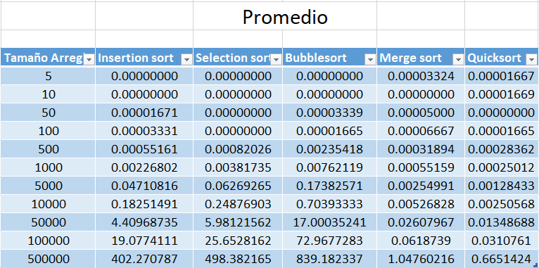
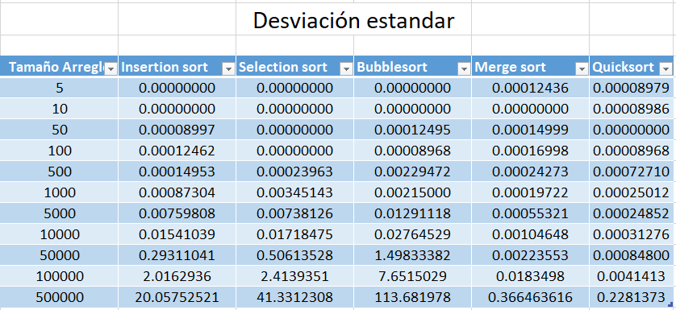
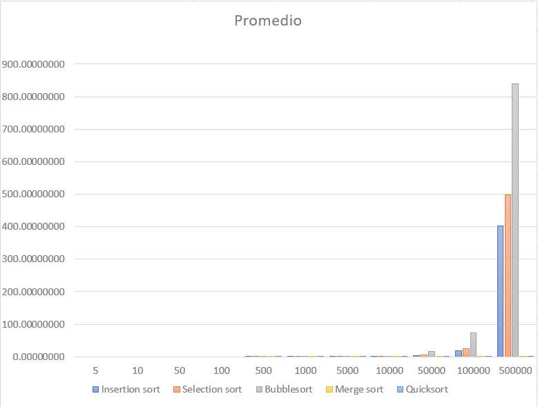
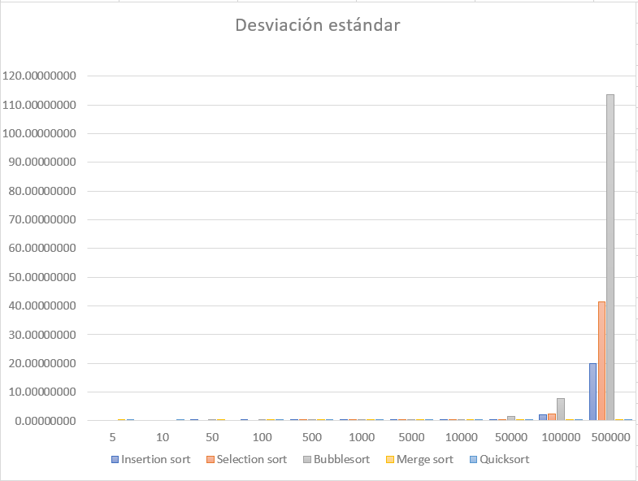

# Práctica 4: Algoritmos de ordenamiento

Fecha: [31/01/2024]

Autor: [Gustavo Angel Morales Vigi]

---
# Resultados:
Tras ejecutar el código mediante la línea de comando y proporcionar diferentes tamaños de arreglos, se han recopilado los siguientes resultados en las Tablas de Promedios de Tiempo en segundos (Imagen 1) y la Desviación Estándar de los valores obtenidos por cada arreglo (Imagen 2).

Imagen 1. Tabla de Promedios:

 
Imagen 2. Tabla de Desviación Estándar:

A partir de estas tablas, se han generado gráficas que representan los distintos algoritmos de ordenamiento con sus respectivos tiempos (Imagen 3) y la desviación estándar (Imagen 4).

Imagen 3. Gráfica de Promedios:

Imagen 4. Gráfica de Desviación Estándar:

# Análisis de los Resultados:
Basándonos en los resultados anteriores, se observa que para arreglos pequeños, los algoritmos iterativos muestran mejores resultados, especialmente en casos de arreglos de tamaño 5 y 10. Esto se atribuye a su estructura de código simple, aunque esta simplicidad puede afectar su rendimiento a medida que el tamaño del arreglo aumenta.

Para arreglos de 50 elementos en adelante, se observa un aumento exponencial en los tiempos de ordenación para los algoritmos secuenciales, superando a los algoritmos recursivos. Esta brecha se amplía a medida que el tamaño del arreglo aumenta.

Insertion Sort muestra tiempos de ejecución consistentemente bajos, mientras que Selection Sort y Bubble Sort comienzan a aumentar. Merge Sort y Quicksort tienen un desempeño competitivo, siendo más eficientes que los algoritmos iterativos a medida que aumenta el tamaño del arreglo.

Merge Sort y Quicksort se desempeñan bien, pero hay variaciones dependiendo del tamaño del conjunto de datos. Quicksort parece superar a Merge Sort en la mayoría de los casos, especialmente para conjuntos de datos más grandes.

La tendencia exponencial en los tiempos de ordenación para algoritmos secuenciales en arreglos más grandes indica que estos algoritmos podrían no ser sostenibles para conjuntos de datos extensos. La complejidad cuadrática de algoritmos como Bubble Sort se hace evidente en este análisis.

Notamos que algunos valores de desviación estándar son cero para ciertos tamaños de arreglos y algoritmos. Esto indica que los tiempos de ejecución fueron consistentes y no hubo variabilidad en esos casos particulares.

A medida que el tamaño del conjunto de datos aumenta, la desviación estándar tiende a aumentar, especialmente para algoritmos como Bubblesort, Insertion Sort y Selection Sort. Este comportamiento es esperado ya que, con conjuntos de datos más grandes, los tiempos de ejecución pueden variar más debido a la complejidad de los algoritmos cuadráticos.

# Conclusiones:
Algoritmos de ordenamiento simples como Insertion Sort, Selection Sort y Bubble Sort pueden ser más eficientes para arreglos pequeños debido a sus estructuras de código simples, mientras que Merge Sort y Quick Sort destacan para conjuntos de datos más grandes debido a su complejidad de tiempo promedio más baja.

Bubble Sort muestra los peores resultados de tiempo de ordenamiento, ya que su complejidad es proporcional a n^2, lo que significa que el número de comparaciones y movimientos de datos crece cuadráticamente con el tamaño del arreglo.

Mejor para la práctica 
En términos generales, Merge Sort y Quick Sort tienden a ser más eficientes en la práctica para conjuntos de datos grandes debido a su complejidad de tiempo promedio más baja en comparación con los otros algoritmos.